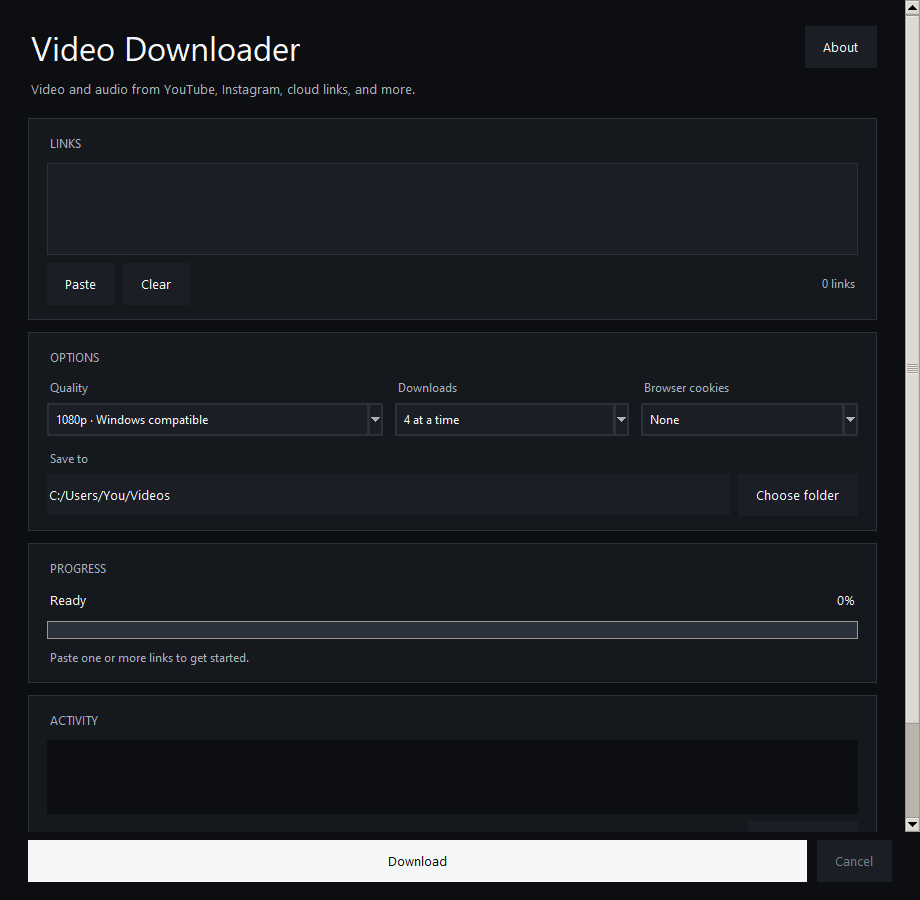

<h1 align="center">Video Downloader for Windows</h1>
<p align="center">A simple Windows app for saving video and audio with yt-dlp.</p>
<p align="center"><a href="https://github.com/kudyaroff/video-downloader-windows/releases/latest">Download for Windows</a> · <a href="docs/windows.md">Setup</a> · <a href="docs/development.md">Development</a> · <a href="LICENSE">MIT</a></p>



Paste your links, choose the quality, and save the files to a folder. No account, ads, or app telemetry.

## What it does

- Video up to 4K, or audio in M4A.
- Several links in one batch, with up to four downloads at a time.
- Progress, cancellation, resume of partial downloads, and a list of failed links.
- YouTube, Instagram, Google Drive, public Yandex Disk files, direct links, and other sites supported by yt-dlp.

Support depends on the website and your installed yt-dlp version. Login requirements, removed videos, and site changes can prevent a download. Playlists and Yandex folder links are not supported. Cloud file links keep the original file; the quality limit applies to video formats, not to those original files. “Windows compatible” prefers H.264/AAC; fallback files may need another player or codec.

## Windows setup

1. Get `Video-Downloader-Windows-x64.zip` from [Releases](https://github.com/kudyaroff/video-downloader-windows/releases/latest). Extract the whole folder.
2. Install the tools below in PowerShell. Read and accept any installer agreements you agree to.
3. Open `Video Downloader.exe`, paste your links, choose a folder, and click **Download**.

```powershell
winget install --exact --id yt-dlp.yt-dlp --source winget
winget install --exact --id Gyan.FFmpeg --source winget
winget install --exact --id DenoLand.Deno --source winget
winget install --exact --id Microsoft.VCRedist.2015+.x64 --source winget
```

The ZIP includes Python, so you do not need to install Python for the executable. yt-dlp, FFmpeg/ffprobe, Deno and the Microsoft Visual C++ runtime are separate downloads. The runtime is often already installed. Deno helps with YouTube's JavaScript challenges.

The executable is unsigned, so Windows may show a warning. Verify the source and the release checksum before deciding to run it; do not disable your antivirus.

See [Windows setup](docs/windows.md) for manual installation and common errors.

## Run from source

Install [Python 3.11 or newer](https://www.python.org/downloads/windows/), including Tcl/Tk, and the tools above. Download and extract this repository, then open PowerShell in its folder:

```powershell
python -m venv .venv
.\.venv\Scripts\python.exe -m pip install -e .
.\.venv\Scripts\python.exe run.py
```

There is no need to activate the environment or change PowerShell's execution policy. The app itself has no third-party Python runtime dependencies.

## If a download fails

Click **Check tools** to check the tool paths and versions. Update yt-dlp, then try again. The **Activity** panel contains the error. Failed links are saved as `failed_downloads.txt` in the output folder.

Browser cookies are optional and read locally by yt-dlp. Use only a browser profile you control and a source you are allowed to access. Cookies do not guarantee that a blocked link will work. Do not share cookies or logs with private links.

## Privacy and lawful use

Downloads run on your computer. The app does not send your links to a project server. yt-dlp, the source website and any installed tools still make their own network requests. Preferences are stored locally; cookies are not stored by this app.

Download only material you are allowed to save. Public access does not automatically grant permission to copy. Follow the source's terms and applicable law. The app does not provide rights to other people's content or features for bypassing DRM or paid/private access. Availability and universal legality are not guaranteed. See [lawful use](docs/legal.md).

## Contributing

Bug reports and small improvements are welcome. See [development](docs/development.md) and [CONTRIBUTING](CONTRIBUTING.md). For security issues, read [SECURITY](SECURITY.md).

## License and credits

Our code is [MIT licensed](LICENSE). Bundled runtime components and external tools keep their own licenses; see [third-party notices](THIRD_PARTY_NOTICES.md).

Built around [yt-dlp](https://github.com/yt-dlp/yt-dlp) and [FFmpeg](https://ffmpeg.org/). Interface details are inspired by [Emil Kowalski's design principles](https://github.com/emilkowalski/skills). No affiliation or endorsement is implied.

This repository currently contains the desktop app. An online version is not included.
